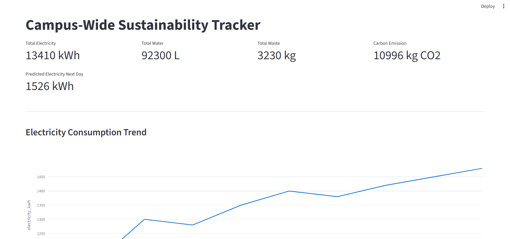
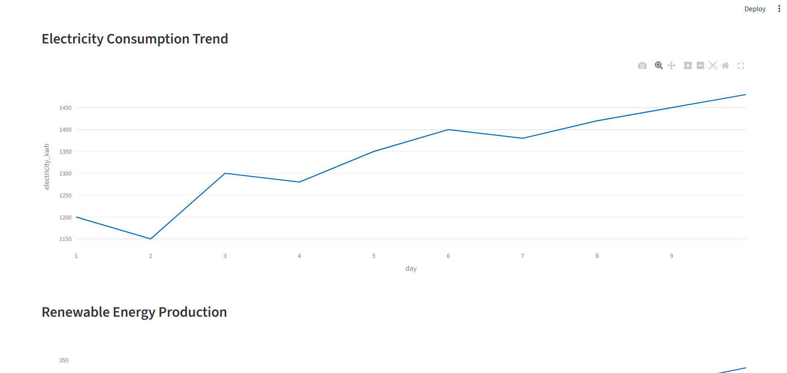
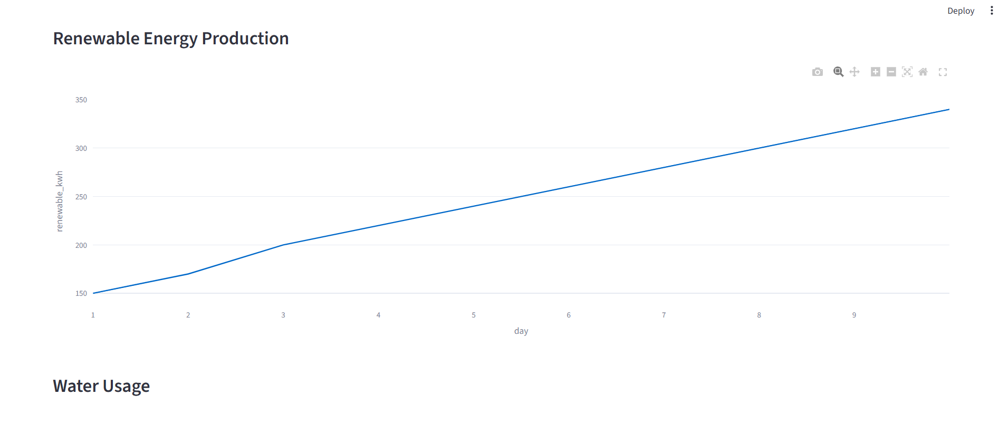
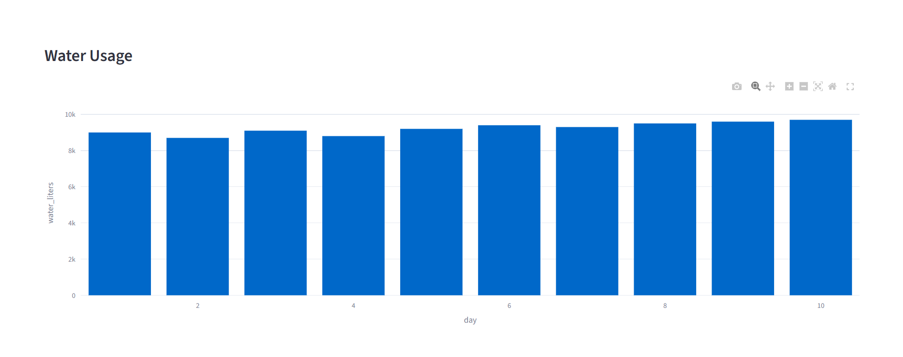
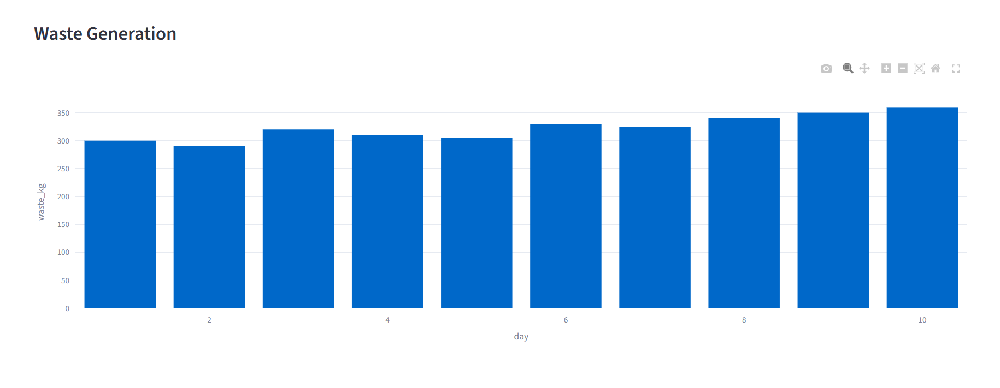
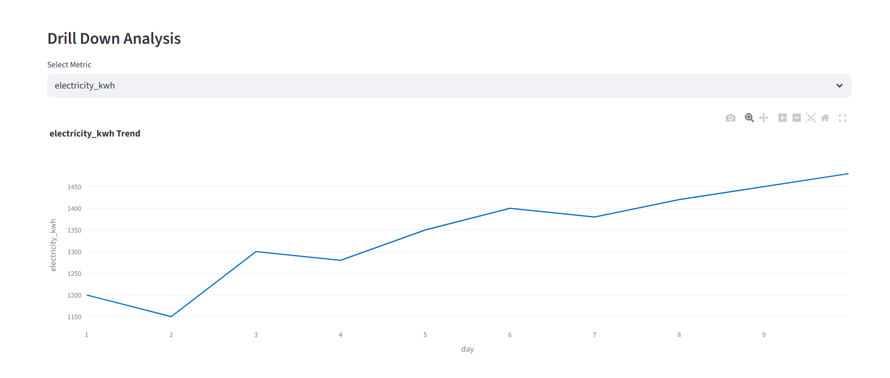

# Campus-Wide Sustainability Tracker






## Project Overview

Campus-Wide Sustainability Tracker is a simple data analytics dashboard designed to monitor sustainability metrics across a campus environment. The system tracks electricity consumption, water usage, waste generation, and renewable energy production.

It also estimates carbon emissions and predicts future electricity consumption using a basic **Linear Regression machine learning model**.

The dashboard presents sustainability indicators through interactive charts and KPI metrics to help visualize environmental impact and resource usage.

---

## Features

### Sustainability KPIs

The dashboard calculates and displays:

* Total electricity consumption
* Total water usage
* Total waste generated
* Carbon emissions produced
* Predicted electricity consumption for the next day

### Data Visualization

Interactive charts are used to visualize trends:

* Electricity consumption trend
* Renewable energy production trend
* Water usage per day
* Waste generation per day

### Carbon Emission Calculation

Carbon emissions are estimated using an emission factor.

Formula

Carbon Emission = Electricity Consumption × Emission Factor

Emission Factor used in this project

0.82 kg CO₂ per kWh

Example

Electricity consumption = 1200 kWh

Carbon emission = 1200 × 0.82 = 984 kg CO₂

### Machine Learning Prediction

A **Linear Regression model** is trained on historical electricity usage data.

Model equation

Y = a + bX

Where

* Y = predicted electricity consumption
* X = time (day)
* a = intercept
* b = slope

The model predicts electricity consumption for the next day.

---

## Technology Stack

Programming Language
Python

Framework
Streamlit

Libraries
Pandas
NumPy
Scikit-learn
Plotly

---

## Project Structure

```
campus-sustainability-tracker
│
├── app.py
└── requirements.txt
```

---

## Installation

Clone the repository

```
git clone https://github.com/yourusername/campus-sustainability-tracker.git
```

Move into the project directory

```
cd campus-sustainability-tracker
```

Install required dependencies

```
pip install -r requirements.txt
```

---

## Running the Application

Start the Streamlit server

```
python -m streamlit run app.py
```

Open the browser

```
http://localhost:8501
```

The dashboard will load automatically.

---

## Dashboard Output

The application displays:

* Sustainability KPI cards
* Electricity consumption prediction
* Energy usage trend charts
* Water consumption chart
* Waste generation chart
* Renewable energy production chart
* Dataset table view

---

## Purpose of the Project

The main goal of this project is to demonstrate how simple data analytics and machine learning techniques can be used to monitor sustainability metrics and estimate environmental impact in institutions such as universities or campuses.

This type of system can help administrators understand resource usage patterns and support environmentally responsible decision making.

---

## Future Improvements

Possible enhancements include:

* Integration with real IoT sensors for real-time data collection
* Advanced forecasting models such as ARIMA or Random Forest
* Department-level sustainability analysis
* Carbon reduction recommendations
* Energy optimization algorithms

---

## Conclusion

Campus-Wide Sustainability Tracker is a lightweight analytics application that combines sustainability monitoring with machine learning prediction.

The system demonstrates how data visualization and simple predictive models can provide insights into environmental impact and help promote sustainable resource management.
