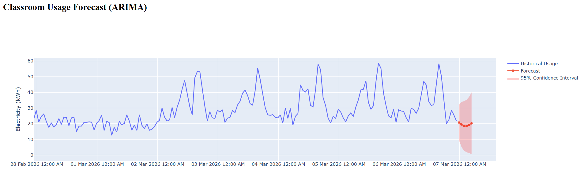

# Classroom Usage Forecasting Dashboard


## Project Overview

Classroom Usage Forecasting Dashboard is a data analytics and forecasting system designed to analyze and predict classroom utilization patterns in an academic institution. The system simulates classroom occupancy data, identifies peak usage periods, and forecasts future classroom demand using time-series forecasting techniques.

The objective of the project is to demonstrate how predictive analytics can assist universities in optimizing classroom scheduling, reducing resource wastage, and improving infrastructure planning.

---

## Problem Statement

Educational institutions often face inefficient classroom allocation due to lack of data-driven insights. Some classrooms remain underutilized while others become overcrowded during peak hours.

Challenges include:

* Difficulty predicting classroom demand
* Inefficient scheduling during peak academic periods
* Poor utilization of infrastructure resources
* Lack of visualization tools for decision-making

This project introduces a forecasting dashboard that predicts classroom usage patterns and visualizes occupancy trends.

---

## Objectives

* Simulate classroom usage data over time
* Analyze hourly and daily classroom utilization patterns
* Predict future classroom demand using time-series forecasting
* Visualize classroom occupancy through an interactive dashboard
* Demonstrate smart campus infrastructure analytics

---

## Key Features

### Classroom Usage Visualization

Displays historical classroom occupancy trends over time.

### Peak Usage Detection

Identifies hours when classroom demand is highest.

### Usage Forecasting

Predicts classroom demand for upcoming time periods using statistical forecasting models.

### Interactive Dashboard

Provides dynamic charts and visualizations using Plotly and Dash.

### Synthetic Data Simulation

Generates realistic classroom usage patterns including weekday schedules and peak academic hours.

---

## Technologies Used

Programming Language
Python

Frameworks and Libraries

* Dash – Interactive web dashboard framework
* Plotly – Data visualization library
* Pandas – Data analysis and manipulation
* NumPy – Numerical computations
* Statsmodels – Time-series forecasting models
* Flask – Backend web server used by Dash

---

## Machine Learning / Forecasting Approach

The system uses **Exponential Smoothing Time Series Forecasting**.

### Definition

Exponential Smoothing is a forecasting method that assigns higher weight to recent observations while gradually decreasing the influence of older data.

### Model Components

Level
Baseline classroom usage

Trend
Increase or decrease in demand over time

Seasonality
Recurring patterns such as daily lecture schedules

### Forecast Equation

Forecast(t + h) = Level + h × Trend + Seasonal Component

This method allows the model to capture realistic classroom usage patterns.

---

## Project Structure

```
Classroom-Usage-Forecasting
│
├── app.py
├── data_generator.py
├── forecasting_model.py
├── requirements.txt
└── README.md
```

### File Description

app.py
Main Dash application that runs the dashboard.

data_generator.py
Generates synthetic classroom usage data.

forecasting_model.py
Implements the time-series forecasting model.

requirements.txt
Contains required Python dependencies.

README.md
Project documentation.

---

## Installation

Clone the repository

```
git clone https://github.com/yourusername/classroom-usage-forecasting.git
```

Navigate to the project directory

```
cd classroom-usage-forecasting
```

Install dependencies

```
pip install -r requirements.txt
```

---

## Running the Application

Start the dashboard server

```
python app.py
```

After running the command, open the browser and navigate to:

```
http://127.0.0.1:8060
```

---

## Dashboard Output

The dashboard provides the following insights:

Historical Classroom Usage
Shows classroom occupancy trends over time.

Forecasted Classroom Demand
Predicts future classroom usage.

Peak Hour Analysis
Highlights time periods with the highest classroom utilization.

---

## Example Applications

Smart Campus Infrastructure
Helps universities manage classroom space more efficiently.

Timetable Optimization
Improves scheduling by predicting demand patterns.

Resource Planning
Assists administrators in allocating classrooms based on predicted usage.

Operational Analytics
Provides insights into academic infrastructure usage.

---

## Future Improvements

* Integration with real-time classroom IoT sensors
* Occupancy detection using computer vision
* Advanced machine learning models such as LSTM
* Multi-building classroom analysis
* AI-based timetable optimization
* Heatmap visualization of classroom occupancy

---

## Conclusion

The Classroom Usage Forecasting Dashboard demonstrates how predictive analytics can improve campus infrastructure management. By forecasting classroom demand and visualizing occupancy patterns, institutions can make informed decisions about scheduling, resource allocation, and infrastructure optimization.

The project highlights the role of data science and machine learning in building smarter and more efficient academic environments.
