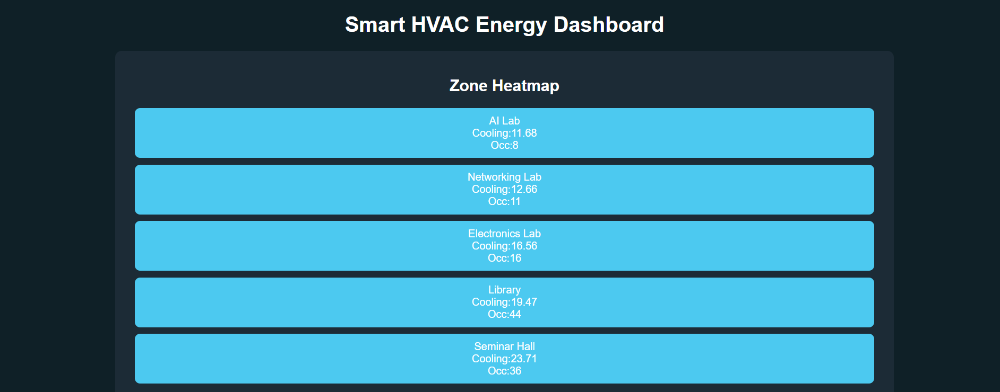
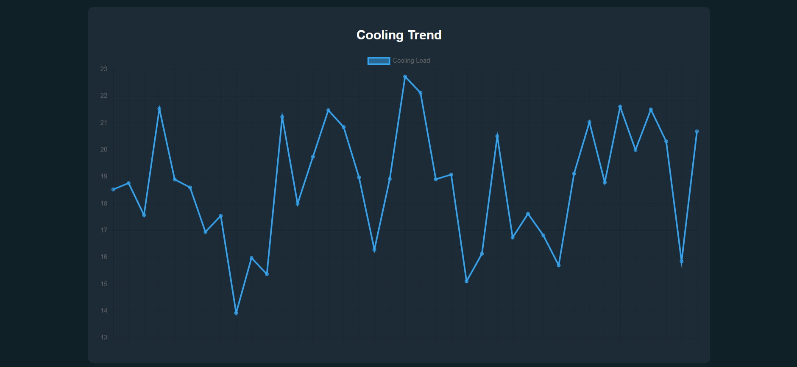

# Smart HVAC Cooling Load Prediction Dashboard

## Overview

Smart HVAC Cooling Load Prediction Dashboard is a machine learning–based web application designed to forecast cooling demand in different zones of a building. The system analyzes environmental conditions and occupancy data to estimate the cooling load required for each zone.

The application combines machine learning with an interactive dashboard to help monitor cooling demand and identify areas that require higher HVAC energy usage.

The system simulates sensor data, predicts cooling load using a Decision Tree model, and displays zone-wise predictions through visual dashboards including heatmaps and real-time graphs.

This project demonstrates how machine learning can support intelligent energy management in buildings.

---





## Key Features

### 1. Multi-Zone Cooling Prediction

The system predicts cooling requirements for multiple building zones such as labs, library, or halls. Each zone has independent environmental conditions and occupancy levels.

### 2. Machine Learning Model

A Decision Tree Regressor is trained using simulated environmental data including:

* Occupancy
* Indoor Temperature
* Outdoor Temperature

The model predicts the cooling load required for efficient HVAC operation.

### 3. Zone Heatmap Visualization

The dashboard displays a heatmap that visually represents cooling demand across zones.

Color interpretation:

* Blue → Low cooling load
* Orange → Moderate cooling load
* Red → High cooling load

This helps quickly identify areas with high cooling requirements.

### 4. Real-Time Cooling Trend Graph

A live graph displays the average cooling load across all zones over time. This helps analyze trends and detect peak energy demand periods.

### 5. Simulated Sensor Data

Since real IoT sensors are not connected, the system generates realistic synthetic data for occupancy and temperature values.

### 6. Interactive Dashboard

The web interface provides a simple dashboard that updates predictions periodically and displays energy demand visually.

---

## Technology Stack

Frontend

* HTML
* CSS
* JavaScript
* Chart.js

Backend

* Python
* Flask

Machine Learning

* Scikit-Learn
* Decision Tree Regressor

Data Processing

* Pandas
* NumPy

Model Storage

* Joblib

---

## Project Structure

```
hvac-smart-system
│
├── app.py
├── model.py
├── data_generator.py
│
├── templates
│      dashboard.html
│
└── static
       style.css
```

---

## How the System Works

1. Synthetic environmental data is generated using `data_generator.py`.

2. A Decision Tree model is trained using:

   * occupancy
   * indoor temperature
   * outdoor temperature

3. The trained model predicts cooling load.

4. The Flask backend serves predictions to the web dashboard.

5. The dashboard visualizes zone-wise predictions and cooling trends.

---

## Installation

Clone the repository:

```
git clone https://github.com/yourusername/hvac-smart-system.git
```

Navigate to the project directory:

```
cd hvac-smart-system
```

Install required dependencies:

```
pip install flask pandas scikit-learn joblib numpy
```

---

## Running the Application

Start the Flask server:

```
python app.py
```

After running the server, open a browser and visit:

```
http://127.0.0.1:5000
```

The HVAC dashboard will load and start displaying zone-wise cooling predictions.

---

## Example Use Cases

* Smart building energy monitoring
* HVAC load forecasting
* Data visualization for energy demand
* Academic machine learning projects
* Smart campus infrastructure research

---

## Future Improvements

Possible enhancements for this project include:

* Integration with IoT temperature sensors
* Real weather API integration
* Advanced ML models such as Random Forest or LSTM
* Energy optimization recommendations
* Historical data storage using databases
* Smart HVAC automation systems

---

