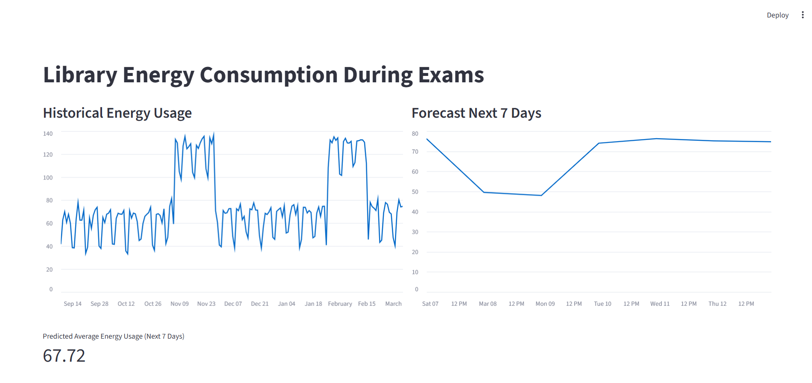

# Library Energy Consumption During Exams


## Project Overview

Library Energy Consumption During Exams is a data analytics and forecasting application that analyzes how energy usage in a library changes during exam periods. The system simulates historical energy consumption data, identifies exam-related demand spikes, and forecasts energy usage for the next 7 days using time-series forecasting techniques.

The goal of the project is to demonstrate how machine learning and data analysis can help institutions anticipate energy demand and optimize resource management during high-traffic academic periods.

---

## Problem Statement

Libraries experience significant fluctuations in energy consumption during exam periods due to:

* Increased student occupancy
* Higher usage of lighting systems
* Continuous air-conditioning usage
* Increased device charging and laptop usage

Without forecasting tools, institutions cannot efficiently plan energy usage or optimize HVAC systems during peak periods.

This project provides a predictive system that forecasts energy demand and visualizes historical patterns.

---

## Objectives

* Simulate realistic library energy consumption data
* Identify the effect of exam periods on energy demand
* Apply time-series forecasting to predict future energy usage
* Visualize historical trends and predictions through an interactive dashboard
* Demonstrate how predictive analytics can support smart campus energy management

---

## Key Features

Historical Energy Visualization
Displays simulated historical energy consumption of the library over the past 180 days.

Exam Period Impact Modeling
Energy demand increases during exam periods to simulate real-world usage patterns.

7-Day Energy Forecast
Predicts future energy consumption using exponential smoothing time-series forecasting.

Interactive Dashboard
Built with Streamlit to provide an interactive and easy-to-use visualization interface.

Synthetic Data Generation
Generates realistic datasets including weekday patterns, exam spikes, and noise.

---

## Technologies Used

Programming Language
Python

Libraries and Frameworks

* Streamlit – Interactive dashboard development
* Pandas – Data manipulation and analysis
* NumPy – Numerical computations and synthetic data generation
* Statsmodels – Time-series forecasting models
* Matplotlib / Streamlit charts – Data visualization

---

## Machine Learning Approach

The project uses Holt-Winters Exponential Smoothing for forecasting.

Definition
Exponential Smoothing is a time-series forecasting method that assigns exponentially decreasing weights to past observations.

Model Components

Level
Baseline energy consumption

Trend
Gradual increase or decrease in energy usage

Seasonality
Weekly patterns such as weekday vs weekend differences

Forecast Equation

Forecast(t + h) = Level + h × Trend + Seasonal Component

This approach allows the system to model realistic energy consumption patterns.

---

## Project Structure

```
Library-Energy-During-Exams
│
├── app.py
├── data_generator.py
├── event_calendar.py
├── model.py
├── requirements.txt
└── README.md
```

File Description

app.py
Main Streamlit dashboard application

data_generator.py
Generates synthetic historical energy usage data

event_calendar.py
Simulates exam period events

model.py
Implements the forecasting model

requirements.txt
List of required Python libraries

---

## Installation

Clone the repository

```
git clone https://github.com/yourusername/library-energy-forecast.git
```

Navigate to the project directory

```
cd library-energy-forecast
```

Install dependencies

```
pip install -r requirements.txt
```

---

## Running the Application

Run the Streamlit app

```
python -m streamlit run app.py
```

After running the command, open your browser and visit

```
http://localhost:8501
```

---

## Dashboard Output

The dashboard provides three main insights:

Historical Energy Usage
Displays past library energy consumption trends.

7-Day Energy Forecast
Predicts upcoming energy demand using time-series analysis.

Predicted Average Energy Consumption
Shows the expected average energy usage over the next week.

---

## Example Use Cases

Smart Campus Management
Universities can forecast electricity usage and optimize energy distribution.

HVAC Optimization
Predicting demand allows better scheduling of cooling systems.

Infrastructure Planning
Helps administrators prepare for peak energy loads during exams.

Sustainability Monitoring
Supports energy efficiency initiatives and carbon reduction strategies.

---

## Future Improvements

Real-time IoT data integration from smart meters

Advanced machine learning models such as:

* LSTM neural networks
* Random Forest regression
* Prophet forecasting

Zone-wise energy heatmaps for library floors

Integration with building management systems

Energy anomaly detection for detecting unusual spikes

---

## Conclusion

This project demonstrates how predictive analytics and time-series forecasting can be applied to smart campus energy management. By analyzing historical patterns and forecasting future demand, institutions can make informed decisions to optimize energy consumption during high-activity periods such as exams.

The system highlights the practical intersection of data science, sustainability, and infrastructure management.

