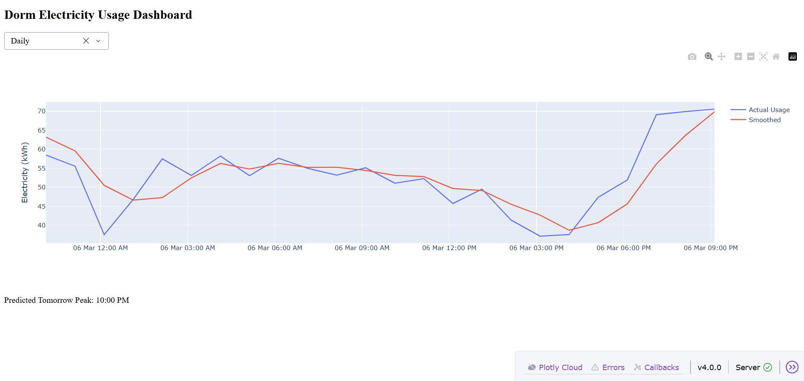

# Peak Hour Electricity Spike Prediction Dashboard

## Overview

Peak Hour Electricity Spike Prediction Dashboard is a data analytics and machine learning application designed to monitor and predict electricity consumption patterns in a dormitory environment. The system analyzes historical electricity usage data and identifies peak usage periods when electricity demand is highest.

The dashboard visualizes electricity consumption trends and predicts the next expected peak usage time. This helps in managing energy demand efficiently and preventing sudden electricity load spikes.

The application is built using Python with the Dash framework for interactive visualization and Plotly for dynamic charts.

---



## Key Features

### 1. Electricity Usage Visualization

The dashboard displays electricity usage over time using an interactive line chart. It shows:

* Actual electricity consumption
* Smoothed usage trends

This allows users to easily identify fluctuations and patterns in electricity usage.

---

### 2. Peak Hour Prediction

The system predicts the expected peak electricity usage time based on historical patterns.

Example output displayed on the dashboard:

Predicted Tomorrow Peak: 10:00 PM

This feature helps in anticipating high-demand periods and planning electricity distribution accordingly.

---

### 3. Multi-Level Time Analysis

Users can view electricity usage data at different time resolutions using the dropdown menu:

* Daily view
* Monthly view
* Yearly view

This enables flexible analysis of electricity consumption trends.

---

### 4. Data Smoothing

The dashboard calculates a smoothed trend line using statistical averaging techniques. This reduces noise in the data and highlights the underlying electricity consumption pattern.

The graph includes:

* Blue Line → Actual electricity usage
* Red Line → Smoothed electricity usage trend

---

### 5. Interactive Dashboard

The Plotly Dash interface allows users to interact with the graph through:

* Zooming
* Panning
* Data inspection
* Dynamic updates

---

## Technology Stack

Backend & Dashboard

* Python
* Dash
* Plotly

Data Processing

* Pandas
* NumPy

Machine Learning / Prediction Logic

* Scikit-Learn (for spike prediction models)
* Custom peak detection algorithm

---

## Project Structure

```
Peak Hour Electricity Spikes
│
├── app.py
├── model.py
├── data_generator.py
├── requirements.txt
└── README.md
```

---

## How the System Works

1. The system generates or loads electricity usage data.

2. The data is preprocessed and smoothed to remove noise.

3. The application analyzes patterns in electricity consumption.

4. The dashboard displays electricity usage trends through an interactive chart.

5. The system predicts the next peak usage time based on historical patterns.

---

## Installation

Clone the repository:

```
git clone https://github.com/yourusername/peak-hour-electricity-dashboard.git
```

Navigate to the project folder:

```
cd peak-hour-electricity-dashboard
```

Install dependencies:

```
pip install -r requirements.txt
```

---

## Running the Application

Start the dashboard server:

```
python app.py
```

After running the command, open a browser and visit:

```
http://127.0.0.1:8050
```

The electricity usage dashboard will appear with interactive charts and peak predictions.

---

## Example Use Cases

This system can be used for:

* Dormitory electricity monitoring
* Energy demand analysis
* Smart campus infrastructure
* Peak load management
* Energy optimization research

---

## Future Improvements

Possible enhancements include:

* Real IoT smart meter integration
* Deep learning time-series forecasting
* Real-time electricity monitoring
* Automatic load balancing recommendations
* Energy anomaly detection

---

